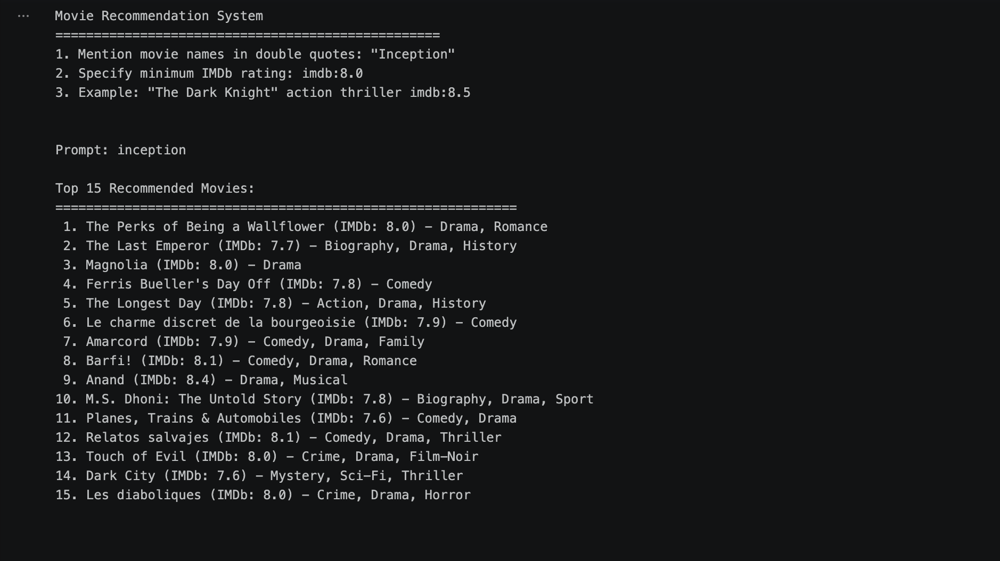

# 🎥 Transformers-Powered Movie Recommendation System (IMDb Scraping)

## 📖 Overview
This project is a **BERT-powered movie recommendation engine** that processes natural language user queries to suggest personalized movie recommendations. Users can input preferences such as specific movie titles or minimum IMDb ratings, and the system generates recommendations by analyzing **semantic similarity** between user queries and movie metadata.  

Recommendations are refined using **IMDb ratings** and previously mentioned movie preferences, ensuring high-quality, tailored results.  

---

## ✨ Features
1. **User Input Parsing**  
   - Recognizes movie names wrapped in double quotes (e.g., `"Inception"`).  
   - Supports IMDb rating filters via `imdb:<rating>` (e.g., `imdb:8.2`).  

2. **BERT Embeddings**  
   - Leverages **Hugging Face’s `bert-base-uncased`** model for semantic embeddings of movie overviews and user input.  

3. **Similarity Calculation**  
   - Computes **cosine similarity** between input and dataset embeddings.  
   - Uses weighted similarity when specific movies are included in the query.  

4. **Customizable Recommendations**  
   - Apply IMDb rating filters.  
   - Include specific movies to fine-tune results.  

5. **Top-N Suggestions**  
   - Returns the **top 15 most relevant movies** ranked by similarity score.  

---

## Create Environment
- python3 -m venv venv_name
- Windows:
   - `source venv_name/bin/activate`
- MacOS:
   - `source venv_name/bin/activate`

## ⚙️ Requirements
- Python 3.7+  
- Dependencies:  
  - `pandas`  
  - `numpy`  
  - `torch`  
  - `transformers`  
  - `scikit-learn`  
  - `re`  

---

## 📊 Dataset
The system uses the file **`imdb_top_1000.csv`**, which must contain the following columns:  
- `Genre`  
- `Series_Title`  
- `IMDB_Rating`  
- `Overview`  

---

## 🔧 Installation
1. Clone this repository or download it:  
   ```bash
   git clone https://github.com/lilswapnil/Movie-Recommendation-System-using-Transformers-and-IMDb-web-scraping.git
   cd transformers-powered-Movies-recommendation-system-using-IMDB-web-scraping
   ```

2. Install dependencies:
   ```bash
   pip install pandas numpy torch transformers scikit-learn
   ```

3. Download the dataset `imdb_top_1000.csv` and place it in the working directory.

4. Update the `file_path` variable in the script to point to the dataset location.

---

## ▶️ Usage
Run the script:
```bash
python trans2.py
```

Follow the prompts:
- Enter movie names in double quotes (e.g., `"Inception"`).
- Specify minimum IMDb ratings (e.g., `imdb:8`).

The system will return the top 15 recommended movies.

---

## 🔗 Link the Notebook Kernel and VS Code Terminal (macOS)

Follow these steps to ensure your Jupyter notebook kernel and VS Code integrated terminal use the same Python environment.

1) Create and activate a virtual environment (project root):
```bash
python3 -m venv .venv
source .venv/bin/activate
python -m pip install --upgrade pip
```

2) Install dependencies (and the Jupyter kernel helper):
```bash
# If you have a requirements.txt, prefer:
# pip install -r requirements.txt

pip install numpy pandas torch transformers scikit-learn tensorflow ipykernel
```

3) Register this environment as a Jupyter kernel:
```bash
python -m ipykernel install --user --name=movie-rec-venv --display-name "MovieRec (venv)"
```

4) In VS Code, select the same kernel and interpreter:
- Command Palette → “Jupyter: Select Notebook Kernel” → pick “MovieRec (venv)”.
- Command Palette → “Python: Select Interpreter” → choose `.venv/bin/python` for this workspace.

5) Ensure the VS Code terminal uses the same environment:
- Close all integrated terminals in VS Code and open a new one. You should see `(.venv)` in the prompt.
- If not, activate manually:
```bash
source .venv/bin/activate
```

6) Verify they match:
- In a notebook cell:
```python
import sys; print(sys.executable)
```
- In the VS Code terminal:
```bash
which python
```
Both should point to `<project>/.venv/bin/python`.

7) Optional: pin the interpreter for this workspace (auto-activates terminal):
Create or update `.vscode/settings.json`:
```json
{
  "python.defaultInterpreterPath": ".venv/bin/python"
}
```

Troubleshooting:
- List installed kernels: `jupyter kernelspec list`
- Remove an old kernel: `jupyter kernelspec remove <kernel-name>`

---

# 🎥 Transformers-Powered Movie Recommendation System (IMDb Scraping)

<p align="center">
  
  <br/>
  <em>High-level flow of the BERT-powered recommendation pipeline.</em>
</p>

## 📖 Overview
This project is a BERT-powered movie recommendation engine...

---

## 🖥 Example Results

<p align="center">
  
  <br/>
  <em>Sample recommendations returned by the system for query inputs.</em>
</p>

---

## 🛠 Code Walkthrough
1. **Data Loading & Preprocessing**  
   - Loads dataset via pandas.  
   - Filters relevant columns (`Genre`, `Series_Title`, `IMDB_Rating`, `Overview`).  

2. **BERT Model Integration**  
   - Loads BERT tokenizer & model (`bert-base-uncased`).  
   - Converts movie overviews into embeddings.  

3. **User Input Processing**  
   - Normalizes text and extracts movie names / IMDb rating constraints.  

4. **Similarity Calculation**  
   - Computes cosine similarity between input embeddings and movie embeddings.  
   - Adjusts weighting if specific movies are mentioned.  

5. **Recommendation**  
   - Returns top 15 matches ranked by similarity scores.  

---

## 🖥 Example
**Input:**
```bash
"Inception" imdb:8
```

**Output:**
```markdown
Recommended Movies:
1. The Dark Knight
2. Interstellar
3. Fight Club
4. Memento
5. The Prestige
...
```

---

## ⚡ Customization
- **IMDb Filter** → Adjust `extract_imdb_rating()` for custom thresholds.  
- **Number of Results** → Change output size in `recommend_movies()` function.  

---

## 🚧 Limitations
- Limited to `imdb_top_1000.csv` dataset quality.  
- Embedding generation with BERT is computationally expensive for large datasets.  

---

## 🔮 Future Enhancements
- Include genre and cast-based filtering.  
- Fine-tune BERT embeddings on movie-specific datasets.  
- Add complex query support (e.g., “sci-fi thrillers with rating > 8”).  
- Optimize performance for larger movie datasets.  

---

## 🙏 Acknowledgments
- Dataset sourced from IMDb.  
- BERT model provided by the Hugging Face Transformers library.  
